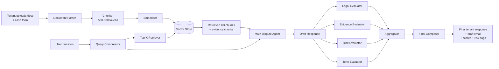

# Deposit Defender AI

An agentic RAG assistant that helps UK tenants challenge unfair landlord deposit deductions with evidence-backed dispute responses.

## The problem

UK tenants routinely lose money to unfair deposit deductions because:

- Advice exists (Citizens Advice, Shelter, deposit scheme ADR docs) but execution is manual.
- Tenants don't know which charges are legally weak (e.g. blanket "professional cleaning" clauses, admin fees) versus genuinely owed.
- Drafting a firm-but-polite dispute letter that cites the right evidence is intimidating without legal training.
- Deadlines slip; evidence stays scattered across emails, PDFs, and inventory reports.

This is a structured, repetitive workflow over a narrow domain — exactly where agentic AI helps.

## What it does

1. Tenant fills in case details and uploads tenancy documents (agreement, check-in/out inventories, landlord deduction email, etc.).
2. RAG pipeline identifies likely deduction themes and retrieves focused chunks from a curated UK tenancy knowledge base + the uploaded documents.
3. The **main dispute agent** drafts a structured response: per-deduction analysis, draft email to landlord, next actions, risk flags.
4. Four **evaluator agents** review that draft in parallel — Legal Grounding, Evidence Usage, Risk & Safety, Tone & Clarity.
5. The **aggregator + composer** combine evaluator output, enforce the disclaimer, escalate high-risk cases, and produce the final tenant-facing result.

## Architecture



## Tech stack

- **Next.js 16** (App Router, Turbopack) + React 19 + TypeScript
- **Tailwind CSS v4** — dashboard-style UI
- **OpenAI SDK** as the LLM client, with a local-first fallback chain. Ollama/Qwen runs first for privacy, then optional free/cloud backups such as Gemini or OpenRouter, then any legacy OpenAI-compatible provider.
- **Local in-memory vector store** with cosine similarity — no external DB
- **Local-first embeddings** through Ollama `nomic-embed-text`, with OpenAI-compatible embeddings and deterministic hash fallback available.
- **File-system cache** for KB embeddings (`.cache/kb-embeddings.json`)

## Token & hardware efficiency

The pipeline is designed to send the smallest useful context to the model on every call:

- **Chunking:** ~600 words / 100-word overlap.
- **Per-deduction retrieval:** the system creates focused queries for likely dispute themes such as cleaning, repainting/fair wear, mattress stains, admin fees, and deposit scheme/ADR.
- **Top-K retrieval:** each focused query retrieves a small set of KB and evidence chunks, then deduplicates the final context pack.
- **Citation chips:** retrieved chunks receive IDs like `KB1` and `DOC1`, and deduction analyses can show which sources support each recommendation.
- **Query compression:** the retrieval query is built deterministically from `issue category + amount + question + canonical UK tenancy terms` rather than the raw user prompt.
- **Structured JSON outputs:** every agent emits typed JSON, not prose, so the UI doesn't pay for re-parsing tokens.
- **Provider fallback:** chat calls try local Ollama first, then Gemini, then OpenRouter, then the legacy OpenAI-compatible config. API failures, empty responses, and invalid JSON all trigger the next provider. If all providers fail, the deterministic demo fallback still keeps the app usable.
- **Provider-specific evaluator models:** evaluator calls can use smaller models per provider, for example `OLLAMA_EVALUATOR_MODEL` or `GEMINI_EVALUATOR_MODEL`.
- **KB embedding cache:** the curated KB is embedded once and cached. Cache is invalidated automatically if source files change or the embedding dimension changes.
- **Graceful degradation:** every agent and the embedding layer fall back to deterministic local responses if the LLM call fails or no key is set, so the demo stays runnable offline.

The results dashboard surfaces "X of Y available chunks sent to the model — context reduced by ~Z%" so this is visible to the user.

## How to run locally

```bash
npm install
cp .env.example .env.local      # then edit (see below)
npm run dev
```

Open http://localhost:3000.

### Environment variables

Copy `.env.example` to `.env.local` and edit as needed. By default the demo tries local Ollama first:

```
OLLAMA_ENABLED=true
OLLAMA_BASE_URL=http://localhost:11434/v1
OLLAMA_API_KEY=ollama
OLLAMA_MODEL=qwen2.5-coder:3b
OLLAMA_EMBEDDINGS_ENABLED=true
OLLAMA_EMBEDDING_MODEL=nomic-embed-text:latest
```

Make sure the model names match your laptop:

```bash
ollama list
ollama pull qwen2.5-coder:3b
ollama pull nomic-embed-text
```

Optional backup 1, **Google Gemini**: get a key at https://aistudio.google.com/app/apikey

```
GEMINI_API_KEY=your-gemini-key
GEMINI_MAIN_MODEL=gemini-2.0-flash
GEMINI_EVALUATOR_MODEL=gemini-2.0-flash
```

Optional backup 2, **OpenRouter** or another free-tier OpenAI-compatible provider:

```
OPENROUTER_API_KEY=your-openrouter-key
OPENROUTER_MAIN_MODEL=openrouter/free
OPENROUTER_EVALUATOR_MODEL=openrouter/free
```

Legacy OpenAI/OpenAI-compatible config is still supported:

```
OPENAI_API_KEY=sk-...
OPENAI_BASE_URL=
MAIN_LLM_MODEL=gpt-4o-mini
EVALUATOR_LLM_MODEL=gpt-4o-mini
EMBEDDING_MODEL=text-embedding-3-small
```

**No working provider:** the app still runs end-to-end. Embeddings fall back to a deterministic local hash; agents return curated demo responses for the Aisha Khan case. Good for screenshots, not for analyzing real cases.

## Demo case

Click **View Demo Case** on the landing page (or visit `/demo`) for a pre-loaded scenario:

- Tenant **Aisha Khan** vs landlord **ABC Lettings**
- £1,200 deposit; £775 in proposed deductions (cleaning, repainting, mattress, admin fee)
- Four uploaded documents: tenancy agreement, check-in inventory, check-out report, landlord deduction email

Click **Analyse Demo Dispute**, watch the multi-agent pipeline run, and review the deduction-by-deduction analysis, draft email, evaluator scores, and retrieved sources.

## Pages & API

- `/` — landing
- `/case/new` — case intake + document upload
- `/case/results` — dashboard
- `/demo` — pre-loaded Aisha Khan case
- `POST /api/analyse` — runs the full RAG + multi-agent pipeline
- `GET  /api/demo` — returns the seeded demo case data

## Future improvements

- Real ingestion of TDS / DPS / MyDeposits scheme decisions
- OCR for scanned PDFs and photos
- Email integration to send the dispute directly
- Calendar reminders for ADR deadlines
- Evidence-bundle PDF export for ADR submission
- Outcome learning: anonymized previous dispute outcomes feed back into RAG
- Scheme-specific dispute templates (TDS vs DPS vs MyDeposits flows)
- Scotland / Wales / NI legal differences
- Multilingual tenant support
- Secure document storage with per-case retention policies
- Human advisor handoff (Citizens Advice / Shelter)

## Disclaimer

This tool helps organise evidence and draft tenancy deposit dispute communications. **It does not provide legal advice** and does not replace a solicitor, Citizens Advice, Shelter, or your deposit protection scheme.
